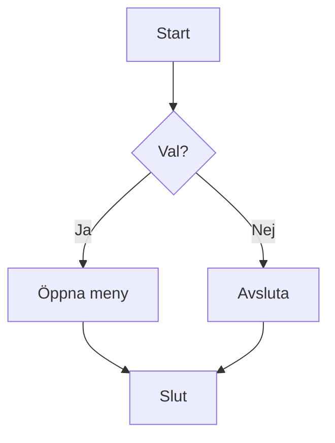

```mermaid
flowchart TD

A[Start] --> B{Val?}

B -->|Ja| C[Öppna meny]
B -->|Nej| D[Avsluta]

C --> E[Slut]
D --> E
```

@startuml

start

if (?) then (yes)
  :Continue;
else (no)
  :Show error;
endif

stop

@enduml